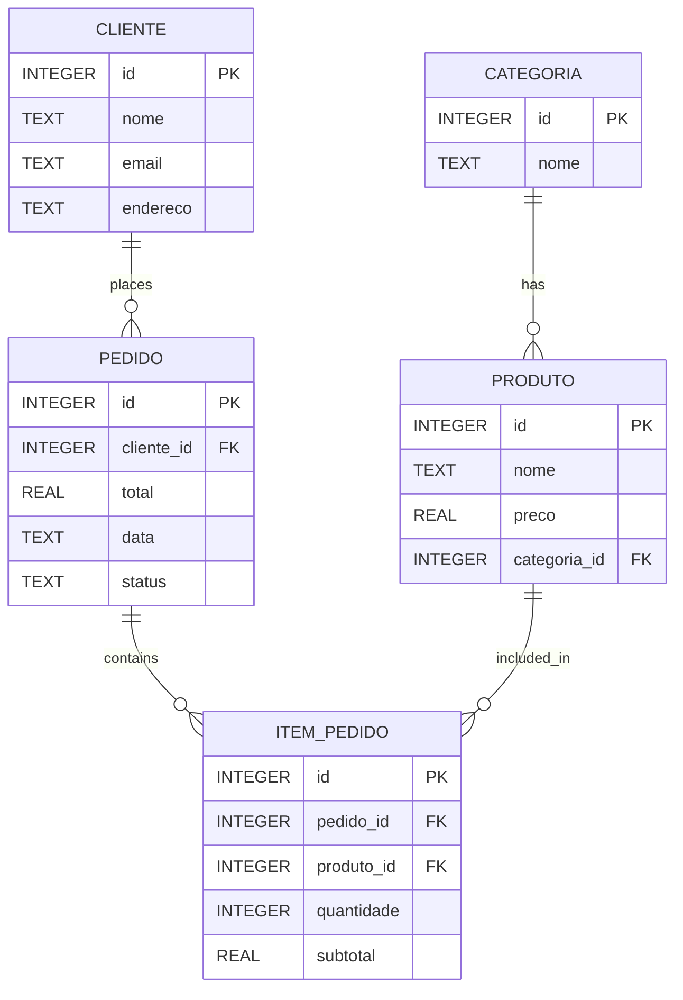

<div align="center">

# PedeJá API

**RESTful backend for a food delivery application — full domain coverage with automatic order total calculation.**

[](https://www.java.com/)
[](https://spring.io/projects/spring-boot)
[](https://spring.io/projects/spring-data-jpa)
[](https://www.sqlite.org/)
[](https://swagger.io/)
[](https://maven.apache.org/)

</div>

---

## Overview

**PedeJá** is a RESTful API simulating the backend of a food delivery platform. It covers the full delivery domain — categories, products, customers, orders and order items — with automatic subtotal and order total calculation triggered on item insertion. All endpoints are documented and testable via **Swagger UI**.

---

## Features

| Domain | Operations |
|---|---|
| Category | Create, list |
| Product | Create, list — linked to category |
| Customer | Create, list |
| Order | Create, list — linked to customer |
| Order Item | Add products to orders, automatic subtotal and total calculation |

---

## Database Schema



---

## Tech Stack

| Technology | Role |
|---|---|
| Java 21 | Core application language |
| Spring Boot | Project configuration and runtime |
| Spring Data JPA / Hibernate | ORM, entity relationships and schema management |
| SQLite | Lightweight file-based database |
| Swagger / OpenAPI | Interactive API documentation |
| Maven | Dependency management and build |

---

## API Reference

### Customer — `POST /cliente`

```json
{
  "nome": "Gabriel",
  "email": "gabriel@email.com",
  "endereco": "São Paulo"
}
```

### Category — `POST /categoria`

```json
{
  "nome": "Massas"
}
```

### Product — `POST /produto`

```json
{
  "nome": "Pizza Calabresa",
  "preco": 49.9,
  "categoria": { "id": 1 }
}
```

### Order — `POST /pedido`

```json
{
  "cliente": { "id": 1 },
  "data": "2026-05-07",
  "status": "CONFIRMADO"
}
```

### Order Item — `POST /item-pedido`

```json
{
  "pedido": { "id": 1 },
  "produto": { "id": 1 },
  "quantidade": 2
}
```

> Item insertion automatically calculates the line subtotal and updates the parent order total.

---

## Architectural Decisions

**Automatic total calculation on item insertion** — Rather than computing totals at query time or delegating to the client, order totals are recalculated and persisted on every `POST /item-pedido`. This keeps the data consistent at the database level and reduces client-side logic.

**SQLite via Spring Data JPA** — SQLite was chosen to keep the project infrastructure-free and immediately runnable. The JPA abstraction means migrating to PostgreSQL or MySQL requires only a dependency and configuration change — the repository layer remains untouched.

**Entity relationships modelled explicitly** — Category → Product, Customer → Order, Order → Order Item, and Product → Order Item are all defined as proper JPA associations, reflecting a normalised relational schema rather than flat JSON storage.

---

## Roadmap

- [x] Full delivery domain — categories, products, customers, orders, order items
- [x] Automatic subtotal and order total calculation
- [x] Entity relationships with Spring Data JPA
- [x] Swagger / OpenAPI documentation
- [ ] PUT and DELETE endpoints for all resources
- [ ] DTO pattern — decouple API contract from entity layer
- [ ] Bean Validation — request input validation
- [ ] Exception handling with structured error responses
- [ ] PostgreSQL / MySQL production profile
- [ ] Docker containerisation
- [ ] Authentication and authorisation with Spring Security + JWT

---

## How to Run

### Prerequisites

- Java 21 or higher
- Maven 3.8 or higher

### 1. Clone the repository

```bash
git clone https://github.com/gabrieodev/pedeja-api.git
cd pedeja-api
```

### 2. Build and run

```bash
mvn spring-boot:run
```

The API will be available at `http://localhost:8080`.

### 3. Access Swagger UI

```
http://localhost:8080/swagger-ui.html
```

---

## License

This project is licensed under the [MIT License](LICENSE).

---

<div align="center">

**PedeJá API** — Delivery domain, fully modelled. Java 21 · Spring Boot · SQLite · Swagger

</div>
