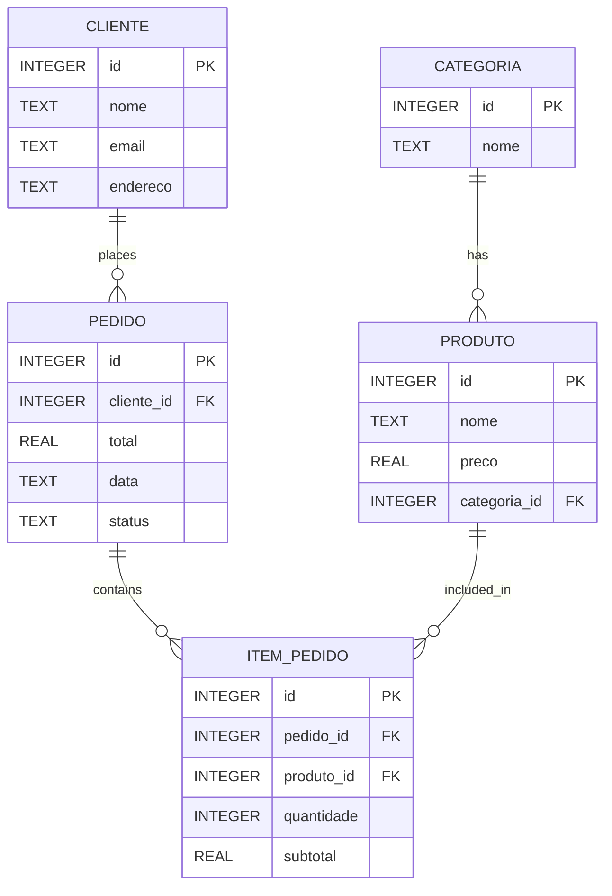

# PedeJa API 🍕⚙️

A RESTful API for a food delivery application built with Java, Spring Boot, and SQLite.

This project simulates a real-world delivery backend, including:

- Product management
- Categories
- Customers
- Orders
- Order items
- Automatic order total calculation
- Entity relationships
- SQLite database persistence
- Swagger API documentation

---

## 🚀 Technologies

- Java 21
- Spring Boot
- Spring Data JPA
- Hibernate
- SQLite
- Maven
- Swagger / OpenAPI

---

## 📦 Features

### Category
- Create categories
- List categories

### Product
- Create products
- List products
- Product-category relationship

### Customer
- Create customers
- List customers

### Order
- Create orders
- List orders
- Customer-order relationship

### Order Item
- Add products to orders
- Automatic subtotal calculation
- Automatic order total update

---

# 🗂 Database Structure



---

## 📘 API Documentation

### Swagger UI
```bash
http://localhost:8080/swagger-ui.html
```

---

## ▶️ Running the Project

### Clone the repository
```bash
git clone <repository-url>
```

### Open the project and run
```bash
mvn spring-boot:run
```

### The API will start at
```bash
http://localhost:8080
```

---

## 🧪 Example Endpoints

### Create Product

#### POST `/produto`
```json
{
  "nome": "Pizza Calabresa",
  "preco": 49.9,
  "categoria": {
    "id": 1
  }
}
```

---

### Create Order

#### POST `/pedido`
```json
{
  "cliente": {
    "id": 1
  },
  "data": "2026-05-07",
  "status": "CONFIRMADO"
}
```

---

### Add Item to Order

#### POST `/item-pedido`
```json
{
  "pedido": {
    "id": 1
  },
  "produto": {
    "id": 1
  },
  "quantidade": 2
}
```

---

## 🎯 Future Improvements

- PUT and DELETE endpoints
- Authentication and authorization
- DTO pattern
- Exception handling
- Validation annotations
- MySQL/PostgreSQL support
- Docker support
- Android frontend integration
- Deployment

---

## 👨‍💻 Author

**Gabriel Azevedo**  
Computer Science Student and Backend Developer Enthusiast 🚀
